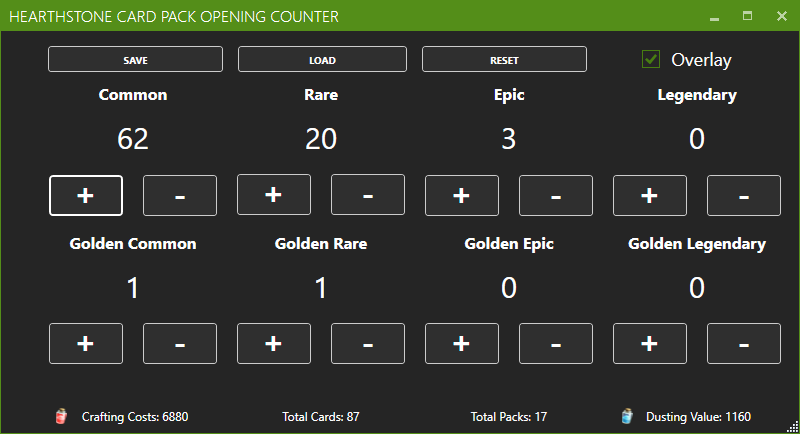
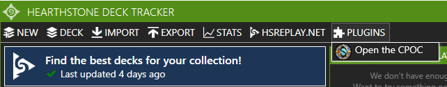
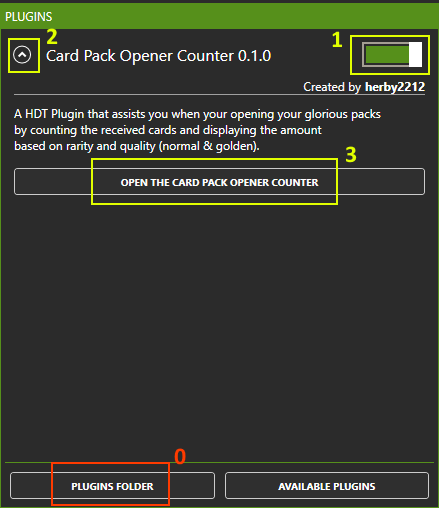

# Hearthstone Card Pack Opening Counter
The Hearthstone Card Pack Opening Counter is a **Plugin** for the **[Hearthstone Deck Tracker](https://github.com/HearthSim/Hearthstone-Deck-Tracker)** for automatically counting the cards received while your pack opening.

***

## Features

### General

The plugin will automatically count any packs opened and cards received while your pack opening without any configuration required.

It will list the cards received based on their rarity and will provide also informations on their dust values and their theoratical crafting costs.

This main window can also be opened directly from the menu bar when the plugin is activated.

The plugin will always support the newest cards included in expansions as it automatically gets the newest data from [HSData](https://github.com/HearthSim/hsdata).

### Overlay

This plugin also features an Overlay mode which, when enabled, creates a small overlay that can be positioned to your liking and is displayed on top of Hearthstone. 

So you have a direct overview of how your pack opening is going.

### Save / Load

The current card count of the different rarities can simply be exported / saved as a file (.hcc / Hearthstone Card Count) file to your desired location via the **Save** button.

This file can then be later imported / loaded via the **Load** button in the main window.

### Planned

The plugin is currently still under the development meaning more features are planned like:

- Buttons in the UI for the individual rarities to manually add/remove a card
- Auto Update your HSReplay Collection with the received Cards
- ~~Export / Import of your opening stats to view older card pack openings~~ [Implemented with Version 1.1.0]
- Live Duplicate checking - see how many duplicates you have drawn based on your collection

## Get Started / Installation
Download the latest release and unzip the **HDT_CardPackOpeningCounter.zip** file to your **Plugins** folder in the root directory of your Hearthstone Deck Tracker.
*You can also Open the Plugins folder in the plugins section of Hearthstone Deck Tracker.*

Then enable it in the plugins window, expand the entry and click on the button to open the Card Pack Opening Counter.

***

## Future Request / Need Help?
Feel free to create a Issue on GitHub for found issues or feature requests.

***

Version: 1.1.0